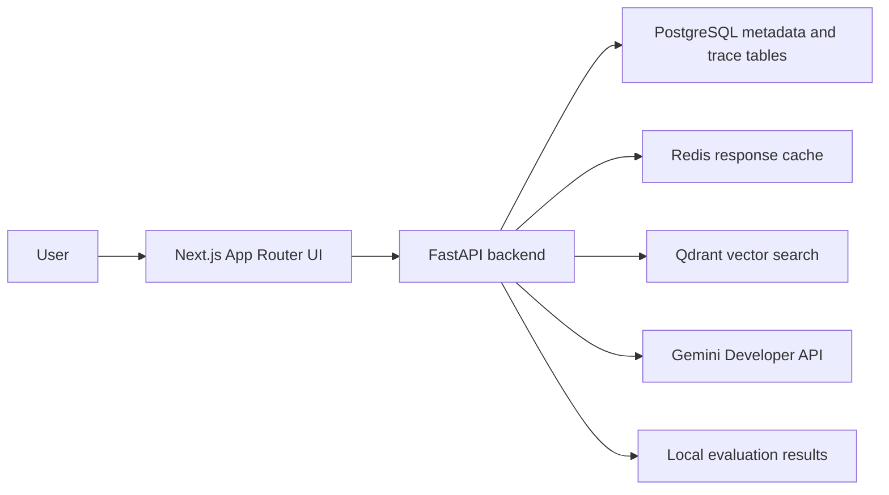

# ProofPilot AI

Evidence-first GenAI decision copilot for uploaded documents and freshness-aware questions.

ProofPilot AI is not a generic chat-with-PDF demo. The MVP is built around retrieval architecture that is visible and testable: secure ingestion, redaction, chunk metadata, hybrid retrieval, citation validation, deterministic routing, contradiction checks, workspace-scoped caching, latency metrics, and a local evaluation dashboard.

## Architecture



Gemini API access is backend-only. The frontend never receives `GEMINI_API_KEY`.

## Features

- Workspace-scoped document ingestion for PDF, TXT, and Markdown.
- Secret redaction before model-bound context.
- Deterministic local embeddings for development vector plumbing.
- Qdrant vector indexing boundary.
- Hybrid retrieval with dense IDs plus keyword scoring and Reciprocal Rank Fusion.
- Structured cited answers with citation ID validation.
- Safe refusal when evidence is missing or citations are fabricated.
- Fast Mode and Verified Mode routing.
- Freshness-required detection with Search grounding disabled by default.
- Deterministic contradiction detection for simple numeric claims.
- Workspace/index-version scoped response caching.
- Local latency metrics.
- Evaluation dashboard with deterministic metrics.

## Tech Stack

- Frontend: Next.js, React, TypeScript, Tailwind CSS, Zod, Vitest.
- Backend: Python 3.13, FastAPI, Pydantic v2, SQLAlchemy async, Alembic, `google-genai`, pytest, ruff, pyright.
- Local infrastructure: PostgreSQL, Redis, Qdrant through Docker Compose.
- Package management: uv for Python, pnpm through Corepack for Node.

## Windows PowerShell Setup

```powershell
corepack enable
pnpm install

cd services/api
uv sync
cd ../..

Copy-Item .env.example .env
```

Edit `.env` locally and set `GEMINI_API_KEY`. Do not paste keys into chat or commit `.env`.

Start local infrastructure:

```powershell
docker compose -f infra/docker-compose.yml up -d
```

Apply migrations:

```powershell
cd services/api
uv run alembic upgrade head
```

Run the backend:

```powershell
cd services/api
uv run uvicorn app.main:app --reload
```

Run the frontend:

```powershell
pnpm --filter @proofpilot/web dev
```

Open `http://localhost:3000`.

## Environment Variables

Use `.env.example` as the source of truth. Current development defaults use:

- `GEMINI_GENERATION_MODEL=gemini-2.5-flash-lite`
- `GEMINI_LIGHTWEIGHT_MODEL=gemini-2.5-flash-lite`
- `GEMINI_FRESH_MODEL=gemini-2.5-flash-lite`
- `GEMINI_SEARCH_GROUNDING_ENABLED=false`

Gemini 3.5 usage is deferred until the final production-readiness review.

## Free-Tier Safety

The MVP requires only:

- Google AI Studio `GEMINI_API_KEY`
- Local Docker services
- Free GitHub repository usage

No OpenAI, Anthropic, Vertex billing, paid search API, hosted Redis, paid vector database, or paid observability service is required. See `docs/free-tier-contract.md`.

## Privacy Warning

Gemini free-tier requests may be eligible for provider product improvement according to provider terms. Use public demo documents only. Do not upload secrets, credentials, private keys, confidential files, or sensitive personal data.

## Quality Gates

Backend:

```powershell
cd services/api
uv run ruff format --check .
uv run ruff check .
uv run pyright
uv run pytest
```

Frontend:

```powershell
pnpm lint
pnpm typecheck
pnpm test
pnpm build
```

Infrastructure:

```powershell
docker compose -f infra/docker-compose.yml config
```

Opt-in local integrations:

```powershell
cd services/api
$env:RUN_INFRA_INTEGRATION='1'
uv run pytest tests/test_qdrant_integration.py tests/test_redis_cache_integration.py -q
```

Manual Gemini smoke:

```powershell
cd services/api
$env:RUN_GEMINI_SMOKE='1'
uv run pytest tests/test_gemini_smoke.py -q
```

## Evaluation Metrics

The evaluation dashboard reports deterministic checks:

- retrieval hit rate
- citation validity
- refusal correctness
- contradiction correctness
- latency p50/p95
- cache hit rate
- secret leakage count

These are not human-reviewed answer-quality scores.

## Demo Walkthrough

1. Start Docker, backend, and frontend.
2. Confirm free-tier mode and privacy warning.
3. Create a workspace through the API or existing UI flow.
4. Upload public demo documents.
5. Ask a document question in Fast Mode.
6. Switch to Verified Mode and inspect route, freshness, citations, and evidence.
7. Ask a no-evidence or freshness-required question and show refusal.
8. Run the evaluation dashboard.
9. Show local quality-gate results.

## Honest Limitations

- Search grounding is disabled by default and not live-smoked automatically.
- Token-by-token SSE is not yet implemented; the UI shows a loading state and consumes structured JSON.
- Deterministic local embeddings are used for current vector plumbing; real Gemini embedding calls are deferred.
- Keyword retrieval currently uses deterministic exact term overlap rather than optimized PostgreSQL full-text ranking.
- Evaluation outcomes are deterministic harness results, not human quality review.
- GitHub Actions are intentionally deferred until final hardening to avoid spending Actions minutes early.

## Roadmap

- Wire upload-time background indexing.
- Add generated OpenAPI TypeScript client.
- Add richer trace drawer and document management UI.
- Add optional live Search grounding path when explicitly enabled.
- Add deeper evaluation datasets and human review workflow.
- Enable GitHub Actions CI at final hardening.
