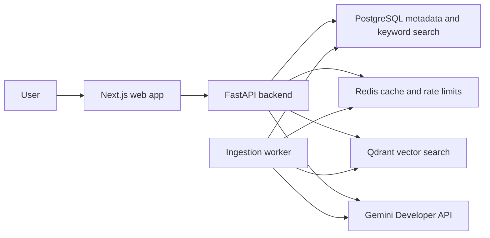

# ProofPilot AI

Evidence-first GenAI decision copilot for document-grounded and freshness-aware answers.

ProofPilot AI is intentionally more than a chat-with-PDF demo. The MVP is being built around explicit retrieval traces, citation integrity, contradiction handling, freshness-aware routing, cache isolation, and measurable evaluation.

## Architecture



## Current Status

Issue 1 is building the engineering foundation:

- Next.js TypeScript frontend in `apps/web`.
- FastAPI Python backend in `services/api`.
- Local infrastructure definition in `infra/docker-compose.yml`.
- Local quality gates for backend and frontend checks.
- Documentation and ADR scaffold.

## Local Setup

Prerequisites:

- Python 3.13
- uv
- Node.js with Corepack
- pnpm
- Docker Compose

```powershell
corepack enable
pnpm install
cd services/api
uv sync
```

Copy `.env.example` to a local ignored `.env` at the repository root as needed. Never commit real API keys.

## Testing

Backend:

```powershell
cd services/api
uv run ruff format --check .
uv run ruff check .
uv run pyright
uv run pytest
```

Frontend:

```powershell
pnpm lint
pnpm typecheck
pnpm test
pnpm build
```

Infrastructure:

```powershell
docker compose -f infra/docker-compose.yml config
```

## Free-Tier Safety

The production MVP must run with only a Google AI Studio `GEMINI_API_KEY`, local Docker services, and free GitHub Actions. See `docs/free-tier-contract.md` for the current verified contract and intentionally disabled capabilities.

Current development/live testing is constrained to `gemini-2.5-flash-lite` for generation routes. Gemini 3.5 model usage is deferred until final production-readiness work.

## Privacy Warning

Gemini free-tier requests may be eligible for provider product improvement under provider terms. Use public demo documents only. Do not upload secrets, credentials, private keys, confidential files, or sensitive personal data.
