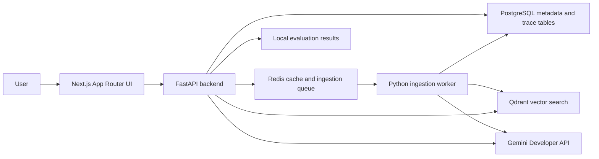

# ProofPilot AI

Evidence-first GenAI decision copilot for uploaded documents and freshness-aware questions.

ProofPilot AI is not a generic chat-with-PDF demo. The MVP is built around retrieval architecture that is visible and testable: secure ingestion, redaction, chunk metadata, hybrid retrieval, citation validation, deterministic routing, contradiction checks, workspace-scoped caching, local telemetry, and a local evaluation dashboard.

## Architecture



Gemini API access is backend-only. The frontend never receives `GEMINI_API_KEY`.

## Features

- Workspace-scoped document ingestion for PDF, TXT, and Markdown.
- Dashboard workspace creation/selection and document upload/listing UI backed by real API routes.
- Redis-queued asynchronous ingestion with visible uploaded-to-ready progress, failure feedback, and single-worker recovery.
- Secret redaction before model-bound context.
- Deterministic local embeddings by default, with opt-in Gemini embeddings for local live testing.
- Qdrant vector indexing boundary.
- Background document indexing into Qdrant through the embedding service boundary.
- Hybrid retrieval with Qdrant dense candidates plus PostgreSQL full-text ranking and Reciprocal Rank Fusion.
- Structured cited answers with citation ID validation.
- Streamed query transport with answer deltas and final citation metadata.
- Safe refusal when evidence is missing or citations are fabricated.
- Retrieval trace panel showing route, effective generation model, cache status, freshness, grounding, query run, retrieved candidates, evidence chunks, latency, and conflicts.
- Fast Mode and Verified Mode routing.
- Freshness-required routing with opt-in, free-tier-safe Google Search grounding, inline web citations, and Search Suggestions display.
- Deterministic contradiction detection for simple numeric claims.
- Workspace/index-version scoped response caching.
- Local latency metrics.
- Trace-safe JSON request logs with `X-Request-ID`, route, status, duration, rate-limit outcome, and safe query-run correlation metadata when available.
- Local aggregate operational metrics for Gemini calls, cache hit/miss counts, and dependency health.
- Evaluation dashboard with deterministic metrics.
- Generated TypeScript API client with OpenAPI drift check.
- Live API health and Gemini settings cards for local demo readiness.

## Tech Stack

- Frontend: Next.js, React, TypeScript, Tailwind CSS, Zod, Vitest.
- Backend: Python 3.13, FastAPI, Pydantic v2, SQLAlchemy async, Alembic, `google-genai`, pytest, ruff, pyright.
- Local infrastructure: PostgreSQL, Redis, Qdrant through Docker Compose.
- Package management: uv for Python, pnpm through Corepack for Node.

## Windows PowerShell Setup

```powershell
corepack enable
pnpm install

cd services/api
uv sync
cd ../..

Copy-Item .env.example .env
```

Edit `.env` locally and set `GEMINI_API_KEY`. Do not paste keys into chat or commit `.env`.

Start local infrastructure:

```powershell
docker compose -f infra/docker-compose.yml up -d
```

Apply migrations:

```powershell
cd services/api
uv run alembic upgrade head
```

Run the backend:

```powershell
cd services/api
uv run uvicorn app.main:app --reload
```

Run the ingestion worker in a separate terminal:

```powershell
cd services/api
uv run python -m app.ingestion.worker
```

Run the frontend:

```powershell
pnpm --filter @proofpilot/web dev
```

Open `http://localhost:3000`.

If another local project already owns backend port `8000`, run the ProofPilot API on another port and set `NEXT_PUBLIC_API_BASE_URL` before starting the frontend, for example `http://127.0.0.1:8010`. If you run the frontend on another port, add its explicit origin to `PROOFPILOT_API_CORS_ORIGINS`; wildcard origins are rejected.

## Environment Variables

Use `.env.example` as the source of truth. Current development defaults use:

- `NEXT_PUBLIC_API_BASE_URL=http://127.0.0.1:8000`
- `QDRANT_COLLECTION=proofpilot_chunks`
- `GEMINI_PROVIDER_MODE=auto`
- `GEMINI_GENERATION_MODEL=gemini-3.1-flash-lite`
- `GEMINI_LIGHTWEIGHT_MODEL=gemini-2.5-flash-lite`
- `GEMINI_FRESH_MODEL=gemini-3.1-flash-lite`
- `GEMINI_SEARCH_GROUNDING_FALLBACK_MODEL=gemini-2.5-flash-lite`
- `GEMINI_EMBEDDING_MODEL=gemini-embedding-2`
- `GEMINI_EMBEDDINGS_ENABLED=false`
- `GEMINI_SEARCH_GROUNDING_ENABLED=false`
- `UPLOAD_INDEXING_ENABLED=true`
- `PROOFPILOT_RATE_LIMITING_ENABLED=true`
- `PROOFPILOT_RATE_LIMIT_SENSITIVE_REQUESTS=20`
- `PROOFPILOT_RATE_LIMIT_WINDOW_SECONDS=60`
- `PROOFPILOT_WORKSPACE_OWNERSHIP_ENABLED=false`

Search grounding remains disabled by default. When enabled, ProofPilot uses a free-tier-safe Search model fallback instead of sending grounded prompts through a model whose free-tier Search pricing is unavailable.

Ordinary document answers use `GEMINI_GENERATION_MODEL` first and retry one temporary provider overload through `GEMINI_LIGHTWEIGHT_MODEL`. Quota exhaustion is surfaced without retry, and the answer trace displays the model that actually succeeded.

Sensitive POST routes for uploads, document queries, streamed queries, and evaluation runs use Redis-backed fixed-window rate limits. Exceeded budgets return HTTP `429` with `Retry-After`; limiter backend failures fail closed with a safe retry response. Disable rate limiting only for controlled local tests.

For local multi-user boundary testing, set `PROOFPILOT_WORKSPACE_OWNERSHIP_ENABLED=true` and send `X-ProofPilot-Session` from clients. Foreign workspace, document, query, and trace access returns `404`; this is a local ownership boundary, not a production auth provider.

Every API response includes `X-Request-ID`. The backend emits one structured JSON request log per request with method, path without query string, status, duration, request ID, and whether the response was rate-limited. Query endpoints also attach safe correlation fields such as query run ID, cache status, effective generation model, and live-grounding usage. Request bodies, uploaded document text, authorization headers, query strings, and API keys are not logged.

For an explicit local current-information test, set `GEMINI_SEARCH_GROUNDING_ENABLED=true` in the ignored `.env` before starting the backend. The grounded response shows live-web source cards and Google's required Search Suggestions content; it never uses a paid fallback route.

## Free-Tier Safety

The MVP requires only:

- Google AI Studio `GEMINI_API_KEY`
- Local Docker services
- Free GitHub repository usage

No OpenAI, Anthropic, Vertex billing, paid search API, hosted Redis, paid vector database, or paid observability service is required. See `docs/free-tier-contract.md`.

## Privacy Warning

Gemini free-tier requests may be eligible for provider product improvement according to provider terms. Use public demo documents only. Do not upload secrets, credentials, private keys, confidential files, or sensitive personal data.

## Quality Gates

Backend:

```powershell
cd services/api
uv run ruff format --check .
uv run ruff check .
uv run pyright
uv run pytest
```

Frontend:

```powershell
pnpm api:check
pnpm lint
pnpm typecheck
pnpm test
pnpm build
```

Browser end-to-end flow:

```powershell
# First run on a new machine only:
pnpm --filter @proofpilot/web exec playwright install chromium
pnpm e2e
```

The Playwright gate runs the production frontend locally and uses deterministic browser-intercepted API/SSE fixtures for the public upload-to-cited-answer flow. It does not use `GEMINI_API_KEY`, Docker services, or a real model request.

Docker-backed full-stack smoke:

```powershell
$env:RUN_FULL_STACK_SMOKE='1'
pnpm fullstack:smoke
```

This opt-in smoke starts local Docker services, applies migrations, runs the API and one ingestion worker, builds/serves the production frontend, uploads a public Markdown document, waits for worker indexing, asks a Verified Mode question, and verifies a cited answer plus retrieval trace. By default it forces `GEMINI_PROVIDER_MODE=mock`, uses deterministic local embeddings, and writes vectors to an isolated Qdrant collection. Set `RUN_FULL_STACK_GEMINI_LIVE=1` only when intentionally spending a tiny live Gemini request with your ignored local `.env`.

Infrastructure:

```powershell
docker compose -f infra/docker-compose.yml config
```

Opt-in local integrations:

```powershell
cd services/api
$env:RUN_INFRA_INTEGRATION='1'
uv run pytest tests/test_qdrant_integration.py tests/test_redis_cache_integration.py tests/test_rate_limiting_integration.py -q
```

Manual Gemini smoke:

```powershell
cd services/api
$env:RUN_GEMINI_SMOKE='1'
uv run pytest tests/test_gemini_smoke.py -q
$env:RUN_GEMINI_EMBEDDING_SMOKE='1'
uv run pytest tests/test_gemini_embedding_smoke.py -q
$env:RUN_GEMINI_SEARCH_SMOKE='1'
uv run pytest tests/test_gemini_search_smoke.py -q
```

## Evaluation Metrics

The evaluation dashboard reports deterministic checks:

- retrieval hit rate
- citation validity
- refusal correctness
- contradiction correctness
- latency p50/p95
- cache hit rate
- secret leakage count

These are not human-reviewed answer-quality scores.

## Demo Walkthrough

1. Start Docker, backend, ingestion worker, and frontend.
2. Confirm free-tier mode and privacy warning.
3. Create or select a workspace in the dashboard.
4. Upload public demo documents.
5. Ask a document question in Fast Mode.
6. Switch to Verified Mode and inspect route, freshness, citations, evidence, and retrieval trace.
7. Ask a no-evidence question and show refusal; with Search grounding explicitly enabled, ask a current-information question and inspect its live-web citations.
8. Run the evaluation dashboard.
9. Show local quality-gate results.

## Honest Limitations

- Search grounding is disabled by default and not live-smoked automatically; provider quota or temporary overload returns a retryable refusal rather than a paid fallback.
- Provider-native token streaming is not yet implemented; the stream currently emits deltas from the finalized cited answer payload.
- Deterministic local embeddings are the default; real Gemini embeddings are opt-in with `GEMINI_EMBEDDINGS_ENABLED=true`.
- Redis ingestion recovery currently supports one local worker process; distributed leases and worker scaling are deferred.
- Evaluation outcomes are deterministic harness results, not human quality review.
- GitHub Actions are intentionally deferred until final hardening to avoid spending Actions minutes early.

## Roadmap

- Add provider-native Gemini token streaming behind the existing stream transport.
- Add richer trace drawer and document management UI.
- Harden live Search evaluation cases and source-history inspection.
- Add deeper evaluation datasets and human review workflow.
- Enable GitHub Actions CI at final hardening.
